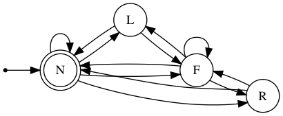

# CarND-Path-Planning-Project

   
## Goals
In this project your goal is to safely navigate around a virtual highway with other traffic that is driving +-10 MPH of the 50 MPH speed limit. You will be provided the car's localization and sensor fusion data, there is also a sparse map list of waypoints around the highway. The car should try to go as close as possible to the 50 MPH speed limit, which means passing slower traffic when possible, note that other cars will try to change lanes too. The car should avoid hitting other cars at all cost as well as driving inside of the marked road lanes at all times, unless going from one lane to another. The car should be able to make one complete loop around the 6946m highway. Since the car is trying to go 50 MPH, it should take a little over 5 minutes to complete 1 loop. Also the car should not experience total acceleration over 10 m/s^2 and jerk that is greater than 10 m/s^3.

## Model Illustration

### Projection

The projection process involves reading data about nearby vehicles from sensor fusion. After obtaining the data, the program will compute the location of other vehicles at the same time of the last point of the  previous planned path. 

```python
// Determine the speed of the other car
double vx = sensor_fusion[i][3];
double vy = sensor_fusion[i][4];
double check_speed = sqrt(vx*vx + vy*vy);
double check_car_s = sensor_fusion[i][5];

// Estimate the other cars' position after executing previous trajectory
check_car_s += (double) prev_size * 0.02 * check_speed;
```

The next step is to calculate their "s" locations in the Frenet space and compare to that of the last point of the  previous planned path. If the distance difference is within the safety limit (30 meter in this case), flags of `<car_ahead>`, `<car_left>`, and `<car_right>` will be triggered depending on the lane location.

Of course, one of the limitations here is that we do not consider of any lane change in the prediction model which may be sufficient in this simulator. If we do need to account for more complex behavior, we should consider using classifier such as Naive Bayes classifier.

### Behavior Planning

We use a finite stat machine (FSM) for behavior planning; available [header file](https://github.com/eglimi/cppfsm)  from online is already directed included in our program.

We specify four states: 
* N = Normal (*accelerate to max velocity without violating maximum acceleration*)
* L = Change to Left Lane
* R = Change to Right Lane
* F = Follow the vehicle ahead (*match speed*)



We use the prediction from sensor fusion to determine 1) CarAhead = True, i.e., there is a car in front of us on the same lane or 2) Clear = True, i.e., there is no car in front of us on the same lane.

Then depending on if we also have car on the left lane or right lane, the FSM will determine if we need to switch lane.

```python
// Initialize FSM
fsm.add_transitions({
    //  from state ,to state  ,triggers        ,guard                    ,action
    { States::Normal  ,States::ChangeLeft ,Triggers::CarAhead  ,[&]{return car_ahead && !car_left && lane > LEFT_LANE;}  ,[&]{lane--;} },
    { States::ChangeLeft ,States::Normal ,Triggers::Clear  ,[&]{return !car_ahead;}  ,[&]{} },
    { States::ChangeLeft ,States::Follow ,Triggers::CarAhead  ,[&]{return car_ahead;}  ,[&]{ ref_vel -= MAX_ACC; } },
    { States::Follow ,States::ChangeLeft ,Triggers::CarAhead  ,[&]{return car_ahead && !car_left && lane > LEFT_LANE;}  ,[&]{lane--;} },

    { States::Normal  ,States::ChangeRight ,Triggers::CarAhead  ,[&]{return car_ahead && !car_right && lane != RIGHT_LANE;}  ,[&]{lane++;} },
    { States::ChangeRight  ,States::Normal ,Triggers::Clear  ,[&]{return !car_ahead;}  ,[&]{} },
    { States::ChangeRight ,States::Follow ,Triggers::CarAhead  ,[&]{return car_ahead;}  ,[&]{ ref_vel -= MAX_ACC; } },
    { States::Follow ,States::ChangeRight ,Triggers::CarAhead  ,[&]{return car_ahead && !car_right && lane != RIGHT_LANE;}  ,[&]{lane++;} },

    { States::Normal  ,States::Follow ,Triggers::CarAhead  ,[&]{return true;}  ,[&]{ref_vel -= MAX_ACC;} },
    { States::Follow  ,States::Follow ,Triggers::CarAhead  ,[&]{return true;}  ,[&]{ref_vel -= MAX_ACC;} },
    { States::Follow  ,States::Normal ,Triggers::Clear  ,[&]{return !car_ahead;}  ,[&]{ref_vel += MAX_ACC;} },
    { States::Normal  ,States::Normal ,Triggers::Clear  ,[&]{return !car_ahead;}  ,[&]{ if (ref_vel < MAX_VEL) { ref_vel += MAX_ACC; }} },

});
```

Of course, one of the caveats here is that there is no prepare to change lane state here. The current model works well for this simple simulated highway model. More complex FSM, however, should be considered for more realistic driving behavior of other vehicles. 

### Trajectory Creation

The trajectory model is based on a spline model explained in the Q&A video. It has the following advantages:

1. **Continuity:** The next trajectory is appended to the previous remaining trajectory to ensure sufficient continuity. 
2. **Speed Control:** the coordinate transformation method elegantly make sure that we are able to maintain the desired speed during lane change.
3. **Low Jerk:** The spline function helps to minimize the jerk during lane switch by providing smooth curve. Alternatively, one can also use Jerk Minimized Trajectory based on a quintic polynomial function. 